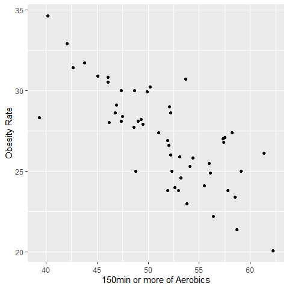
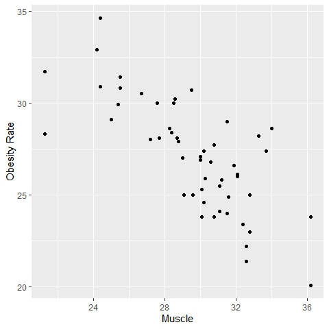
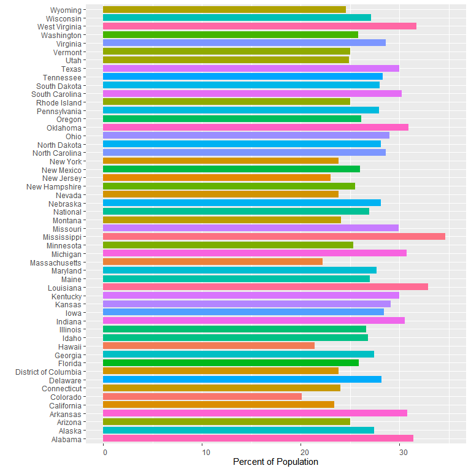
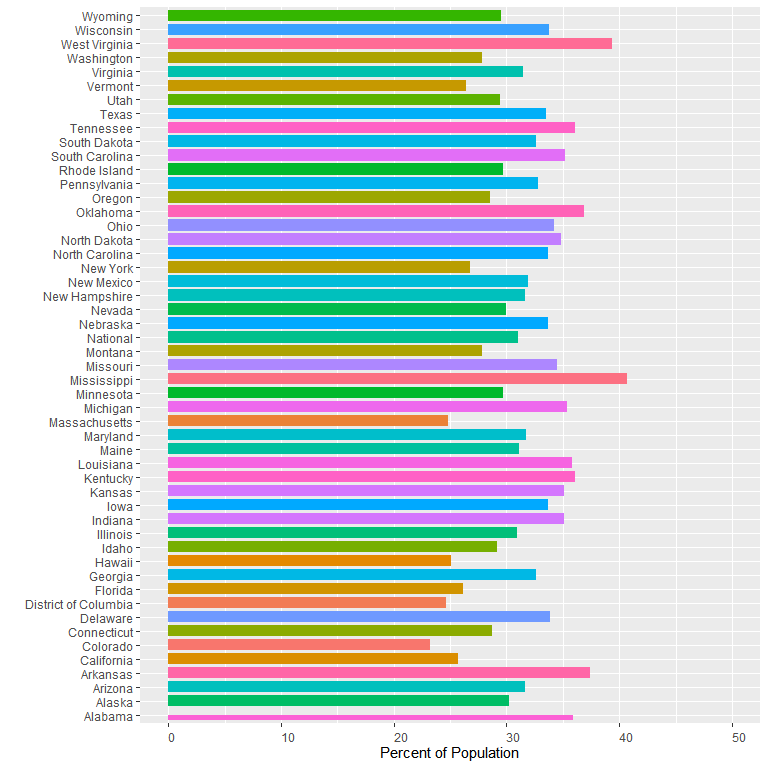

# Keywords: 
Health, Physical Activity, Recreation, United States, Survey

# Introduction {#Intro}

 Physical activity is an important indicator for the health of the population of the United States. As well living near to a public recreational service like a park allows residents a more convenient place to excercise. We see that decreasing the distance to a park as well as giving more opportunity for residents to participate in activities like biking is associated with more physically active residents who meet the CDC's guidelines for strength and aerobic health.

  We analyzed the sources of water for two subsets of the Jordan population, urban and rural residents. From Table \@ref(tab:tab2) and Table \@ref(tab:tab3), we can see that both Colorado is the state with the lowest rate of obesity and that Mississipi is the highest. 

  This information is relevant to the further development and enhancement of the recreational and physical activity of citizens of the United States as well as leader of respective states when developing cities. The data can help to identify populaces with particularly low activity reletive to the rest of the country as well as identify states that are lacking in public recreational support for its citizens.
  
  Overall we found that the state with the highest rates of Obesity was Mississipi, the lowest was Colorado and that there is a relationship between the proportion of state residents participating in recreational activities like muscle training or aerobics and the obesity rate of residents within that state.

  In section \@ref(Data) we talk about the process of gathering and analyzing the dataset and the variables. Then in section \@ref(Model) we build a linear model for the rate of obesity. Then in section \@ref(Results) we discuss the implications of the dataset presented. Finally in section \@ref(Discussion) we discuss implications for the United States citizens, as well as the weakness of the study and the further investigation that may be useful to the topic of recreational activity support and physical activity in the United States.
  

\newpage

# Data {#Data}

  The dataset is from the National Health Interview Survey. The survey was conducted by the Centers for Disease Control and Prevention, [@citeCDC] and the data used was from the years 2010 to 2020.The survey was conducted and funded by the CDC but also has numerous sponsors found [here](https://www.cdc.gov/nchs/nhis/supplements_cosponsors.htm).

  The survey has been conducted every year for over 50 years, the sample is nationally representative, the intent of the survey is to monitor the health of the nation, as it collects information by interviewing American households. The content of the survey is updated roughly every 15-20 years with the most recent being in 2019. Of which 30,000 adults and 9,000 children were interviewed. Of this survey, this analysis focused on the information regarding the proportion of adults classified as obese or overweight, and how they responded to questions regarding aerobic activity and weight training. The data is collected from all 50 states including the District of Columbia, there is also a section included for the National averages of each question response.
  
  To compile the data set, the R language was used[@citeR], along with the packages, Pointblank [@citepointblank], haven [@citehaven], the paper was compiled using Knitr [@citeknitr] and KableExtra[@citeakableExtra] packages. Also made use of reshape2 [@citereshape2] in manipulating the data to create plots.
  
  Table \@ref(tab:tab1) gives a small look at the dataset.

<table class="table table" style="width: auto !important; margin-left: auto; margin-right: auto; margin-left: auto; margin-right: auto;">
<caption>Excerpt of dataset</caption>
 <thead>
  <tr>
   <th style="text-align:center;"> Year </th>
   <th style="text-align:center;"> State </th>
   <th style="text-align:center;"> Question </th>
   <th style="text-align:center;"> Percent </th>
   <th style="text-align:center;"> Age </th>
  </tr>
 </thead>
<tbody>
  <tr>
   <td style="text-align:center;"> 2011 </td>
   <td style="text-align:center;"> Alabama </td>
   <td style="text-align:center;"> Percent of adults aged 18 years and older who have obesity </td>
   <td style="text-align:center;"> 35.2 </td>
   <td style="text-align:center;"> 25 - 34 </td>
  </tr>
  <tr>
   <td style="text-align:center;"> 2011 </td>
   <td style="text-align:center;"> National </td>
   <td style="text-align:center;"> Percent of adults who engage in no leisure-time physical activity </td>
   <td style="text-align:center;"> 16.9 </td>
   <td style="text-align:center;"> 18 - 24 </td>
  </tr>
  <tr>
   <td style="text-align:center;"> 2016 </td>
   <td style="text-align:center;"> Virginia </td>
   <td style="text-align:center;"> Percent of adults aged 18 years and older who have an overweight classification </td>
   <td style="text-align:center;"> 40.1 </td>
   <td style="text-align:center;"> 35 - 44 </td>
  </tr>
  <tr>
   <td style="text-align:center;"> 2016 </td>
   <td style="text-align:center;"> Washington </td>
   <td style="text-align:center;"> Percent of adults who engage in no leisure-time physical activity </td>
   <td style="text-align:center;"> 18.8 </td>
   <td style="text-align:center;"> 55 - 64 </td>
  </tr>
  <tr>
   <td style="text-align:center;"> 2016 </td>
   <td style="text-align:center;"> Alabama </td>
   <td style="text-align:center;"> Percent of adults aged 18 years and older who have an overweight classification </td>
   <td style="text-align:center;"> 35.3 </td>
   <td style="text-align:center;"> 55 - 64 </td>
  </tr>
  <tr>
   <td style="text-align:center;"> 2011 </td>
   <td style="text-align:center;"> National </td>
   <td style="text-align:center;"> Percent of adults who engage in no leisure-time physical activity </td>
   <td style="text-align:center;"> 22.1 </td>
   <td style="text-align:center;"> 25 - 34 </td>
  </tr>
</tbody>
</table>

  In total there are 6 characteristics from the survey being analyzed, they are:
  
1. "Percent of adults aged 18 years and older who have obesity"                                                                                                                                           
2. "Percent of adults aged 18 years and older who have an overweight classification"                                                                                                                      
3. "Percent of adults who engage in no leisure-time physical activity"                                                                                                                                    
4. "Percent of adults who achieve at least 150 minutes a week of moderate-intensity aerobic physical activity or 75 minutes a week of vigorous-intensity aerobic activity (or an equivalent combination)" 

5. "Percent of adults who engage in muscle-strengthening activities on 2 or more days a week"                                                                                                             
6. "Percent of adults who achieve at least 300 minutes a week of moderate-intensity aerobic physical activity or 150 minutes a week of vigorous-intensity aerobic activity (or an equivalent combination)"

These are stratified into 6 different age groups for adults, those 18-24, 25-34, 35-44, 45-54, 55-64, and 65 and older.

The responses are given as a proportion of the sample, rounded to 1 digit. So the value 35.2 means, 35.2% of respondents in that age group had been affirmative to that trait in the survey.

\newpage

# Model {#Model}

  The model being used is $\text{Obesity}=\beta_{\text{Intercept}}+\beta_{\text{150min of Aerobics}}\times (\text{150min of Aerobics or more})+\beta_{\text{Muscle Training}}\times (\text{Muscle Training})$. Where the beta coefficients represent the change in the predictor variables, 150min or more of Aerobics, and Muscle Training, have on the result, being the obesity rate. This model was chosen since other factors like no aerobic activity or 300min or more of aerobic activity were unsuprisingly highly correlated with the 150min of aerobics.
  
  Both Muscle Training and 150min of Aerobic Training had significant p-values in this model of 0.0236 and 0.0027 respectively. Below Figure \@ref(fig:fig5) shows the relationship between 150min of Aerobics training and Muscle Training compared to the rate of Obesity. There was strong positive correlation to people with 300min of aerobic training, and those who did muscle training or 150min of aerobic training so including that interaction was not beneficial. Additionally those that do no aerobic training at all are strongly negatively correlated with those that do 150min or more. Soi including that interaction was not beneficial to the model.
  
  Our data does not have any particularly large outliers that would disturb the model present. And our outcome variable, the proportion of residents who are obese is a continuous variable, thus the bilinear model seems the best choice.

And below Figure \@ref(fig:fig6) shows us the relationship between the rate of obesity and the proportion of a states residents participating in muscle training excercises.

\newpage

# Results {#Results}

  From Figure \@ref(fig:fig1) we see a chart comparing the proportion of respondents who were obese based on the different states in the country. We can see from the chart that all states lie between a rate of 20% and 35% obese. The chart below is for 2011.

Below Table \@ref(tab:tab2), shows the states with the lowest proportions of obesity.
And Table \@ref(tab:tab3) gives the states with the highest obesity rates.

<table class="table table" style="width: auto !important; float: left; margin-right: 10px; margin-left: auto; margin-right: auto;">
<caption>Lowest Obesity Rates By State</caption>
<tbody>
  <tr>
   <td style="text-align:center;"> Colorado </td>
   <td style="text-align:center;"> 20.1 </td>
  </tr>
  <tr>
   <td style="text-align:center;"> Hawaii </td>
   <td style="text-align:center;"> 21.4 </td>
  </tr>
  <tr>
   <td style="text-align:center;"> Massachusetts </td>
   <td style="text-align:center;"> 22.2 </td>
  </tr>
  <tr>
   <td style="text-align:center;"> New Jersey </td>
   <td style="text-align:center;"> 23 </td>
  </tr>
  <tr>
   <td style="text-align:center;"> California </td>
   <td style="text-align:center;"> 23.4 </td>
  </tr>
  <tr>
   <td style="text-align:center;"> District of Columbia </td>
   <td style="text-align:center;"> 23.8 </td>
  </tr>
</tbody>
</table>

<table class="table table" style="width: auto !important;  margin-left: auto; margin-right: auto;">
<caption>Highest Obesity Rates by State</caption>
<tbody>
  <tr>
   <td style="text-align:center;"> Mississippi </td>
   <td style="text-align:center;"> 34.6 </td>
  </tr>
  <tr>
   <td style="text-align:center;"> Louisiana </td>
   <td style="text-align:center;"> 32.9 </td>
  </tr>
  <tr>
   <td style="text-align:center;"> West Virginia </td>
   <td style="text-align:center;"> 31.7 </td>
  </tr>
  <tr>
   <td style="text-align:center;"> Alabama </td>
   <td style="text-align:center;"> 31.4 </td>
  </tr>
  <tr>
   <td style="text-align:center;"> Oklahoma </td>
   <td style="text-align:center;"> 30.9 </td>
  </tr>
  <tr>
   <td style="text-align:center;"> Arkansas </td>
   <td style="text-align:center;"> 30.8 </td>
  </tr>
</tbody>
</table>

  From these tables and the chart above we see the lowest obesity rate in the United States is Colorado with 20.1% and the highest is Mississippi with 34.6%. For this analysis we want to see whether physical activity factors such as aerobic excercise. Below in \@ref(fig:fig2) however we will briefly see how these obesity rates have changed by the end of the decade.

We see from \@ref(fig:fig2) that the overall rate of obesity has clearly increased, however the states with the highest and lowest rates remain largely the same as we can see from Table \@ref(tab:tab4) and Table \@ref(tab:tab5) below.

<table class="table table" style="width: auto !important; float: left; margin-right: 10px; margin-left: auto; margin-right: auto;">
<caption>Lowest Rates of Obesity by State</caption>
<tbody>
  <tr>
   <td style="text-align:center;"> Colorado </td>
   <td style="text-align:center;"> 23.2 </td>
  </tr>
  <tr>
   <td style="text-align:center;"> District of Columbia </td>
   <td style="text-align:center;"> 24.6 </td>
  </tr>
  <tr>
   <td style="text-align:center;"> Massachusetts </td>
   <td style="text-align:center;"> 24.8 </td>
  </tr>
  <tr>
   <td style="text-align:center;"> Hawaii </td>
   <td style="text-align:center;"> 25.1 </td>
  </tr>
  <tr>
   <td style="text-align:center;"> California </td>
   <td style="text-align:center;"> 25.7 </td>
  </tr>
  <tr>
   <td style="text-align:center;"> Florida </td>
   <td style="text-align:center;"> 26.1 </td>
  </tr>
</tbody>
</table>

<table class="table table" style="width: auto !important;  margin-left: auto; margin-right: auto;">
<caption>Highest Rates of Obesity by State</caption>
<tbody>
  <tr>
   <td style="text-align:center;"> Mississippi </td>
   <td style="text-align:center;"> 40.7 </td>
  </tr>
  <tr>
   <td style="text-align:center;"> West Virginia </td>
   <td style="text-align:center;"> 39.4 </td>
  </tr>
  <tr>
   <td style="text-align:center;"> Arkansas </td>
   <td style="text-align:center;"> 37.4 </td>
  </tr>
  <tr>
   <td style="text-align:center;"> Oklahoma </td>
   <td style="text-align:center;"> 36.9 </td>
  </tr>
  <tr>
   <td style="text-align:center;"> Kentucky </td>
   <td style="text-align:center;"> 36.1 </td>
  </tr>
  <tr>
   <td style="text-align:center;"> Tennessee </td>
   <td style="text-align:center;"> 36.1 </td>
  </tr>
</tbody>
</table>

Below we now look at the proportion of state residents participating in aerobic activities for 150min or more per week as well as the proportion of residents participating in muscle strength training for at least 2 hours per week. We see in Table \@ref(tab:tab10) and Table \@ref(tab:tab11) some familiar states from the Obesity rate Tables \@ref(tab:tab4) and Table \@ref(tab:tab5). Namely Alabama which was one of the highest rates for Obesity in the country also has low rates of Aerobic activity.
<table class="table table" style="width: auto !important; float: left; margin-right: 10px; margin-left: auto; margin-right: auto;">
<caption>States with Lowest rates of Aerobic training</caption>
<tbody>
  <tr>
   <td style="text-align:center;"> Kentucky </td>
   <td style="text-align:center;"> 36.9 </td>
  </tr>
  <tr>
   <td style="text-align:center;"> Oklahoma </td>
   <td style="text-align:center;"> 38.1 </td>
  </tr>
  <tr>
   <td style="text-align:center;"> Mississippi </td>
   <td style="text-align:center;"> 39.7 </td>
  </tr>
  <tr>
   <td style="text-align:center;"> Missouri </td>
   <td style="text-align:center;"> 45.1 </td>
  </tr>
  <tr>
   <td style="text-align:center;"> Louisiana </td>
   <td style="text-align:center;"> 45.9 </td>
  </tr>
  <tr>
   <td style="text-align:center;"> Alabama </td>
   <td style="text-align:center;"> 46.1 </td>
  </tr>
</tbody>
</table>

<table class="table table" style="width: auto !important;  margin-left: auto; margin-right: auto;">
<caption>States with Highest rates of Aerobic training</caption>
<tbody>
  <tr>
   <td style="text-align:center;"> Montana </td>
   <td style="text-align:center;"> 63 </td>
  </tr>
  <tr>
   <td style="text-align:center;"> Vermont </td>
   <td style="text-align:center;"> 61.8 </td>
  </tr>
  <tr>
   <td style="text-align:center;"> Colorado </td>
   <td style="text-align:center;"> 59.3 </td>
  </tr>
  <tr>
   <td style="text-align:center;"> Washington </td>
   <td style="text-align:center;"> 58.7 </td>
  </tr>
  <tr>
   <td style="text-align:center;"> Minnesota </td>
   <td style="text-align:center;"> 58.1 </td>
  </tr>
  <tr>
   <td style="text-align:center;"> Alaska </td>
   <td style="text-align:center;"> 57.5 </td>
  </tr>
</tbody>
</table>

We now look at muscle training in Tables \@ref(tab:tab12) and Table \@ref(tab:tab13). Here we see many of the low obesity rate states from earlier, like Colorado, Florida and the District of Columbia.

<table class="table table" style="width: auto !important; float: left; margin-right: 10px; margin-left: auto; margin-right: auto;">
<caption>States with Lowest rates of Muscle Training</caption>
<tbody>
  <tr>
   <td style="text-align:center;"> West Virginia </td>
   <td style="text-align:center;"> 27.5 </td>
  </tr>
  <tr>
   <td style="text-align:center;"> Kentucky </td>
   <td style="text-align:center;"> 28.1 </td>
  </tr>
  <tr>
   <td style="text-align:center;"> Missouri </td>
   <td style="text-align:center;"> 28.7 </td>
  </tr>
  <tr>
   <td style="text-align:center;"> Oklahoma </td>
   <td style="text-align:center;"> 29.2 </td>
  </tr>
  <tr>
   <td style="text-align:center;"> Mississippi </td>
   <td style="text-align:center;"> 29.8 </td>
  </tr>
  <tr>
   <td style="text-align:center;"> Alabama </td>
   <td style="text-align:center;"> 30 </td>
  </tr>
</tbody>
</table>

<table class="table table" style="width: auto !important;  margin-left: auto; margin-right: auto;">
<caption>States with Highest rates of Muscle training</caption>
<tbody>
  <tr>
   <td style="text-align:center;"> Montana </td>
   <td style="text-align:center;"> 40.3 </td>
  </tr>
  <tr>
   <td style="text-align:center;"> District of Columbia </td>
   <td style="text-align:center;"> 40.2 </td>
  </tr>
  <tr>
   <td style="text-align:center;"> Connecticut </td>
   <td style="text-align:center;"> 39.8 </td>
  </tr>
  <tr>
   <td style="text-align:center;"> Vermont </td>
   <td style="text-align:center;"> 39.7 </td>
  </tr>
  <tr>
   <td style="text-align:center;"> Colorado </td>
   <td style="text-align:center;"> 39.6 </td>
  </tr>
  <tr>
   <td style="text-align:center;"> Florida </td>
   <td style="text-align:center;"> 38.8 </td>
  </tr>
</tbody>
</table>
The interesting thing here is we see Montana and Vermont both with very high rates of Aerobic Activity, likely attributed to these states being far more rural then the average state, allowing more opportunity for outdoor activities. However again on the low end 
\newpage

# Discussion {#Discussion}

## FirstPoint {#FirstPoint}
  
  According to [@citeMuscle] "meeting both aerobic and muscle-strengthening exercise guidelines was associated with a lower obesity prevalence, and associations were more pronounced for higher obesity classes." We found similar section \@ref(Results). However we also noted in the model that muscle training and aerobic activities did not fully explain the obesity problems of the United States. Suggesting that while physical activity may be important it is not the entire explanation for the increasing rates of obesity. Research suggest Americans currently consume too many calories, saturated fats, trans fasts and added sugars.[@citeNutrition].
  
  The CDC notes that the solution to obesity in the United States is not simple [@citeCentre]. The CDC notes the solutions are a healthy lifestyle, combining physical activity with healthy eating. They provide plans like the MyPlate Plan to help United States citizens plan their meals and exercise to ensure they are meeting health recommendations.
  
  Some State's have implemented more directly punitive measures to curb obesity, Sugar tax and other so called 'sin taxes' have been implemented in cities such as Philadelphia, Boulder, Colorado, and Berkeley, California [@citeusnews] and according to The American Public Health Association these taxes results in a 21% drop in consumption of sugary drinks in Berkeley [@citeTax]. However in past efforts to cap the availability of junk foods and sodas has been struck down by United States courts. Famously in New York City's ban on large quantity soda's was fought in court and ultimately defeated [@citeNYT], with help in no small part to the soft drink industry spending millions on ad campaigns. Industries built around sugary foods and drinks are large and will fight against measures which may reduce the consumption of their products.
  
  
## Weaknesses and next steps

  Although this analysis found some links between aerobic activity and muscle training to rates of obesity in the United States. It is clear that there is more to the story of obesity in the United States then just the level of physical activity. Next steps for analysis would be researching diet along with exercise. Data in this area in the last 2 years during the pandemic would also be particularly interesting. Particularly in comparing states which had more restricted access to public fitness facilities like gyms and public parks compared to those states which did not employ as strict restrictions, re-opened earlier, or states like Montana which had less population density and more opportunity to open air fitness training compared to densely populated states such as New York.

\newpage

\appendix

# Appendix {-}

## DataSheet {-}
**Motivation**

1. *For what purpose was the dataset created? Was there a specific task in mind? Was there a specific gap that needed to be filled? Please provide a description.*
    - The dataset was created to analyze the responses from National Health Interview Survey regarding physical activity.
2. *Who created the dataset (for example, which team, research group) and on behalf of which entity (for example, company, institution, organization)?*
    - Jonathan Goodwin
3. *Who funded the creation of the dataset? If there is an associated grant, please provide the name of the grantor and the grant name and number.*
    - No one.
4. *Any other comments?*
    - No.

**Composition**

1. *What do the instances that comprise the dataset represent (for example, documents, photos, people, countries)? Are there multiple types of instances (for example, movies, users, and ratings; people and interactions between them; nodes and edges)? Please provide a description.*
	- Each row of the dataset corresponds to a the proportion of intervewees that responded affirmatively to a question by year and stratified by age group.
2. *How many instances are there in total (of each type, if appropriate)?*
	- There are 6 questions, 6 age categories, over the course of 10 years for all 53 states, resulting in 14,196 different entries.
3. *Does the dataset contain all possible instances or is it a sample (not necessarily random) of instances from a larger set? If the dataset is a sample, then what is the larger set? Is the sample representative of the larger set (for example, geographic coverage)? If so, please describe how this representativeness was validated/verified. If it is not representative of the larger set, please describe why not (for example, to cover a more diverse range of instances, because instances were withheld or unavailable).*
	- The dataset is a sample from the larger National Health Interview Survey conducted by the CDC.
4. *What data does each instance consist of? "Raw" data (for example, unprocessed text or images) or features? In either case, please provide a description.*
	- Each instance consists of a numeric value for the proportion of respondents which responded affirmatively to that question in the survey.
5. *Is there a label or target associated with each instance? If so, please provide a description.*
	- No.
6. *Is any information missing from individual instances? If so, please provide a description, explaining why this information is missing (for example, because it was unavailable). This does not include intentionally removed information, but might include, for example, redacted text.*
	- No.
7. *Are relationships between individual instances made explicit (for example, users' movie ratings, social network links)? If so, please describe how these relationships are made explicit.*
	- No.
8. *Are there recommended data splits (for example, training, development/validation, testing)? If so, please provide a description of these splits, explaining the rationale behind them.*
	- No.
9. *Are there any errors, sources of noise, or redundancies in the dataset? If so, please provide a description.*
	- No.
10. *Is the dataset self-contained, or does it link to or otherwise rely on external resources (for example, websites, tweets, other datasets)? If it links to or relies on external resources, a) are there guarantees that they will exist, and remain constant, over time; b) are there official archival versions of the complete dataset (that is, including the external resources as they existed at the time the dataset was created); c) are there any restrictions (for example, licenses, fees) associated with any of the external resources that might apply to a dataset consumer? Please provide descriptions of all external resources and any restrictions associated with them, as well as links or other access points, as appropriate.*
	- The dataset does not rely on any external sources.
11. *Does the dataset contain data that might be considered confidential (for example, data that is protected by legal privilege or by doctor-patient confidentiality, data that includes the content of individuals' non-public communications)? If so, please provide a description.*
	- No, the data is all publicly available from the Department of statistics Jordan and required no special permissions to access.
12. *Does the dataset contain data that, if viewed directly, might be offensive, insulting, threatening, or might otherwise cause anxiety? If so, please describe why.*
	- No.
13. *Does the dataset identify any sub-populations (for example, by age, gender)? If so, please describe how these subpopulations are identified and provide a description of their respective distributions within the dataset.*
	- The data is split into 6 age groups, 18-24, 24-35, 35-45, 45-55, 55-64, and 65 and older.
14. *Is it possible to identify individuals (that is, one or more natural persons), either directly or indirectly (that is, in combination with other data) from the dataset? If so, please describe how.*
	- No individuals can be identified from the dataset.
15. *Does the dataset contain data that might be considered sensitive in any way (for example, data that reveals race or ethnic origins, sexual orientations, religious beliefs, political opinions or union memberships, or locations; financial or health data; biometric or genetic data; forms of government identification, such as social security numbers; criminal history)? If so, please provide a description.*
	- None of the data is of a sensitive nature.
16. *Any other comments?*
	- No.

\newpage

**Collection process**

1. *How was the data associated with each instance acquired? Was the data directly observable (for example, raw text, movie ratings), reported by subjects (for example, survey responses), or indirectly inferred/derived from other data (for example, part-of-speech tags, model-based guesses for age or language)? If the data was reported by subjects or indirectly inferred/derived from other data, was the data validated/verified? If so, please describe how.*
	- The data was originally acquired by the Center for Disease Control and Prevention, [@citeCDC] via the National Health Interview Survey.
2. *What mechanisms or procedures were used to collect the data (for example, hardware apparatuses or sensors, manual human curation, software programs, software APIs)? How were these mechanisms or procedures validated?*
	- Subjects for the survey were interviewed in person.
3. *If the dataset is a sample from a larger set, what was the sampling strategy (for example, deterministic, probabilistic with specific sampling probabilities)?*
	- The sample was from the 50 states of the United States and the District of Columbia and the sampling strategy of cross-sectional household interview survey.
4. *Who was involved in the data collection process (for example, students, crowdworkers, contractors) and how were they compensated (for example, how much were crowdworkers paid)?*
	- The Center for Disease Control and Prevention conducted the survey along with various sponsors.
5. *Over what timeframe was the data collected? Does this timeframe match the creation timeframe of the data associated with the instances (for example, recent crawl of old news articles)? If not, please describe the timeframe in which the data associated with the instances was created.*
	- The data was collected from 2010 to 2020.
6. *Were any ethical review processes conducted (for example, by an institutional review board)? If so, please provide a description of these review processes, including the outcomes, as well as a link or other access point to any supporting documentation.*
	- NHIS surveys are approved and review by the ICF Institutional Review Board( IRB).[@citeNHIS_Ethics].
7. *Did you collect the data from the individuals in question directly, or obtain it via third parties or other sources (for example, websites)?*
	- Individuals of the survey were contacted directly for the survey.
8. *Were the individuals in question notified about the data collection? If so, please describe (or show with screenshots or other information) how notice was provided, and provide a link or other access point to, or otherwise reproduce, the exact language of the notification itself.*
	- Participants are notified of all aspects of the survey.
9. *Did the individuals in question consent to the collection and use of their data? If so, please describe (or show with screenshots or other information) how consent was requested and provided, and provide a link or other access point to, or otherwise reproduce, the exact language to which the individuals consented.*
	- All participants gave consent for their data.
10. *If consent was obtained, were the consenting individuals provided with a mechanism to revoke their consent in the future or for certain uses? If so, please provide a description, as well as a link or other access point to the mechanism (if appropriate).*
	- Participants of the survey are told they may terminate participation at any time.
11. *Has an analysis of the potential impact of the dataset and its use on data subjects (for example, a data protection impact analysis) been conducted? If so, please provide a description of this analysis, including the outcomes, as well as a link or other access point to any supporting documentation.*
	- NHIS is approved by the Research Ethics Review Board of the National Center for Health Statistics and the U.S. Office of Management and Budget. All NHIS respondents provided oral consent prior to participation.
12. *Any other comments?*
	- No
	
**Preprocessing/cleaning/labeling**

1. *Was any preprocessing/cleaning/labeling of the data done (for example, discretization or bucketing, tokenization, part-of-speech tagging, SIFT feature extraction, removal of instances, processing of missing values)? If so, please provide a description. If not, you may skip the remaining questions in this section.*
	- The dataset was reduced from the original sample data provided through the National Health Interview Survey.
2. *Was the "raw" data saved in addition to the preprocessed/cleaned/labeled data (for example, to support unanticipated future uses)? If so, please provide a link or other access point to the "raw" data.*
	- Yes, both the raw data acquired through the survey, and the cleaned version of the dataset is available in the repository associated with this analysis.
3. *Is the software that was used to preprocess/clean/label the data available? If so, please provide a link or other access point.*
	- The R language and packages associated with the cleaning process are all freely available.
4. *Any other comments?*
	- No.

**Uses**

1. *Has the dataset been used for any tasks already? If so, please provide a description.*
	- Prior to this analysis the dataset was only used as part of the original Survey.
2. *Is there a repository that links to any or all papers or systems that use the dataset? If so, please provide a link or other access point.*
	- Yes, it is available on github [here](https://github.com/Jon-Goodwin/Final)
3. *What (other) tasks could the dataset be used for?*
	- The dataset has been minimized for this analysis but the full raw data includes other factors regarding water security that may be of interest.
4. *Is there anything about the composition of the dataset or the way it was collected and preprocessed/cleaned/labeled that might impact future uses? For example, is there anything that a dataset consumer might need to know to avoid uses that could result in unfair treatment of individuals or groups (for example, stereotyping, quality of service issues) or other risks or harms (for example, legal risks, financial harms)? If so, please provide a description. Is there anything a dataset consumer could do to mitigate these risks or harms?*
	- No.
5. *Are there tasks for which the dataset should not be used? If so, please provide a description.*
	- No.
6. *Any other comments?*
	- No.

**Distribution**

1. *Will the dataset be distributed to third parties outside of the entity (for example, company, institution, organization) on behalf of which the dataset was created? If so, please provide a description.*
	- No.
2. *How will the dataset be distributed (for example, tarball on website, API, GitHub)? Does the dataset have a digital object identifier (DOI)?*
	- The dataset is available via Github.
3. *When will the dataset be distributed?*
	- The dataset is currently available via Github.
4. *Will the dataset be distributed under a copyright or other intellectual property (IP) license, and/or under applicable terms of use (ToU)? If so, please describe this license and/ or ToU, and provide a link or other access point to, or otherwise reproduce, any relevant licensing terms or ToU, as well as any fees associated with these restrictions.*
	- No.
5. *Have any third parties imposed IP-based or other restrictions on the data associated with the instances? If so, please describe these restrictions, and provide a link or other access point to, or otherwise reproduce, any relevant licensing terms, as well as any fees associated with these restrictions.*
	- No.
6. *Do any export controls or other regulatory restrictions apply to the dataset or to individual instances? If so, please describe these restrictions, and provide a link or other access point to, or otherwise reproduce, any supporting documentation.*
	- No.
7. *Any other comments?*
	- No.

**Maintenance**

1. *Who will be supporting/hosting/maintaining the dataset?*
	- The dataset will be available on Github
2. *How can the owner/curator/manager of the dataset be contacted (for example, email address)?*
	- No.
3. *Is there an erratum? If so, please provide a link or other access point.*
	- No.
4. *Will the dataset be updated (for example, to correct labeling errors, add new instances, delete instances)? If so, please describe how often, by whom, and how updates will be communicated to dataset consumers (for example, mailing list, GitHub)?*
	- No.
5. *If the dataset relates to people, are there applicable limits on the retention of the data associated with the instances (for example, were the individuals in question told that their data would be retained for a fixed period of time and then deleted)? If so, please describe these limits and explain how they will be enforced.*
	- No.
6. *Will older versions of the dataset continue to be supported/hosted/maintained? If so, please describe how. If not, please describe how its obsolescence will be communicated to dataset consumers.*
	- No.
7. *If others want to extend/augment/build on/contribute to the dataset, is there a mechanism for them to do so? If so, please provide a description. Will these contributions be validated/verified? If so, please describe how. If not, why not? Is there a process for communicating/distributing these contributions to dataset consumers? If so, please provide a description.*
	- No.
8. *Any other comments?*
	- No.

## Code {-}

Repository associated with this analysis is available at [github](https://github.com/Jon-Goodwin/Final)

\newpage

# References
